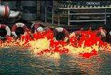
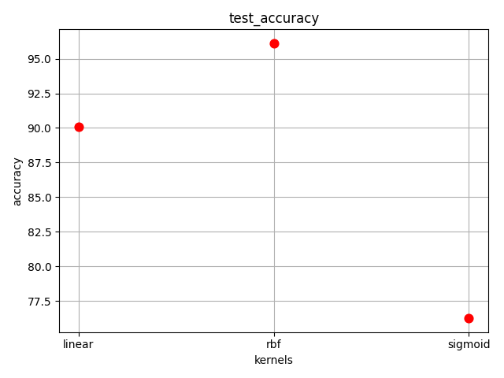

# Fire Detection

[](https://github.com/Yasaman-Honarparvar/Fire-detection/actions/workflows/ci.yml)
[](https://www.python.org/)
[](LICENSE)

Pixel-wise fire detection in images using a supervised SVM classifier. Each
pixel's RGB value is treated as a feature, so the model learns to tell "fire
colored" pixels apart from everything else and highlights them in the output
image.

| Before | After |
| --- | --- |
|  |  |

## How it works

1. **Dataset construction** ([`fire_detection/dataset.py`](src/fire_detection/dataset.py)): every pixel of the training images is
   extracted as an `(R, G, B)` triple and labeled `1` (fire) or `2` (no fire),
   producing one row per pixel.
2. **Training** ([`fire_detection/model.py`](src/fire_detection/model.py)): an SVM classifier is fit on the labeled pixels.
   With the bundled sample images, the rbf kernel generalizes best:

   | Kernel  | Test accuracy |
   | ------- | -------------- |
   | linear  | 90.08% |
   | rbf     | 96.14% |
   | sigmoid | 76.24% |

   

3. **Prediction & highlighting** ([`fire_detection/visualize.py`](src/fire_detection/visualize.py)): the trained model labels every
   pixel of a new image, and pixels confidently predicted as fire are
   recolored red in the output image.

## Installation

```bash
git clone https://github.com/Yasaman-Honarparvar/Fire-detection.git
cd Fire-detection
pip install -e .
```

## Usage

Run the full pipeline (build dataset → train → predict → highlight) on the
bundled sample images:

```bash
fire-detect
```

Or point it at your own images:

```bash
fire-detect \
  --fire-dir path/to/fire_images \
  --no-fire-dir path/to/no_fire_images \
  --image path/to/target.jpg \
  --output-dir outputs
```

Results are written to `outputs/`: the labeled pixel dataset
(`image_dataset.csv`), the predictions for the target image
(`pred_dataset.csv`), and the highlighted image.

Run `fire-detect --help` for all options, including `--kernel` to try `rbf`
or `sigmoid` instead of the default `linear`.

## Development

```bash
pip install -e ".[dev]"
pytest
ruff check src tests
```

## Project layout

```
src/fire_detection/   # library code (dataset building, training, visualization, CLI)
tests/                # pytest suite
data/samples/         # example fire / no-fire / prediction images used by tests and the CLI default
docs/images/          # static images used in this README
```

## License

[MIT](LICENSE)
