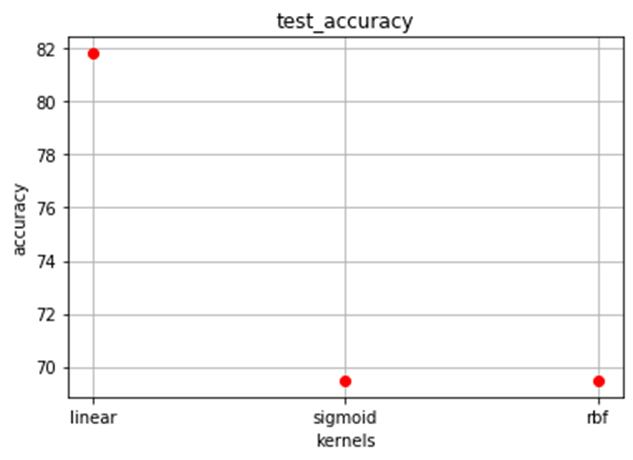

# Fire Detection program Based on Supervised ML Algorithm (SVM)

#### Video Demo: <URL [HERE](https://youtu.be/O89DcTeEPvo?feature=shared)>
#### Description: This program can highlight the part of an image that contains the fire with an acceptable accuracy.
## Installation

Use the package manager [pip](https://pip.pypa.io/en/stable/) to install the necessary libraries to run the program. They are also mentioned in the [request.txt](request.txt).

```bash
pip install imageio
pip install pandas
pip install numpy
pip install sklearn.model_selection
pip install sklearn.svm
pip install scikit-learn
pip install PIL
```
This program can detect the part of the image that contains the fire and highlight it in red color. For doing this job, some pictures that contain the fire and some that do not contain the fire are fed to the program, and some functions are designed that you can find in the following:

## Image_to_dataset Function
In the **image_to_dataset function**,  all of the images convert to the numerical dataset that indeed contains RGB pixels and all of them are labeled based on including fire or not. If the image contains fire, it will be labeled as **1** and also if the image does not contain fire, it will be labeled as  **2**.Images that contain fire are: [fire.jfif](fire.jfif),[fire_2.jpg](fire_2.jpg),[fire_3.jpg](fire_3.jpg) and images do not contain water are: [demo_2.jpg](demo_2.jpg),[river.jpg](river.jpg). All the process of reading images and converting them to the numerical dataset has been done by calling bellow functions that are embedded in the **image_to_dataset function**:
* df_fire
* df_nofire
* image_to_numerical_rgb

As a result, image_dataset.txt is made as the result of this function.
## Fire_detection Function
After making datadset that its name is **image_dataset.txt** it is given to the next function that its name is **fire_detection**. It is a function that trains a dataset (image_dataset.txt) and gets an image ([firewater2.jpg](firewater2.jpg)) as input to predict the label of the image.The Machine learning algorithm that is used is SVM which is a supervised algorithm that is why images are labeled individually. The kernel is **linear** because other kernels including sigmoid and rbf have been tested and their accuracy on the test data has not been as much as linear accuracy.

<style>
img[src$="test_acc.png"] {
  display: block;
  margin:0 ;
  border-radius: 5%;
  max-width: 70%;
}
</style>
<figure>
    
    <figcaption>The test accuracy</figcaption>
</figure>


| Kernels      | Test Accuracy(%) |
| ----------- | ----------- |
| linear      | 89.90 |
| sigmoid   | 65.82 |
| rbf   | 76.29 |


The result of this prediction that results in labeling the image is saved in the **pred_dataset.txt**.

## Show_pred_fire Function
 It is a function that highlights the fire based on the trained dataset and saves the result into 'myimg.jpeg'.
You can see the image before and after of fire detection below:

<style>
img[src$="firewater2.jpg"] {
  display: block;
  margin:l;
  border-radius: 5%;
  max-width: 100%;
}
</style>
<figure>
    
    <figcaption>The Image before the detection of the fire</figcaption>
</figure>
<style>
img[src$="myimg.jpeg"] {
  display: block;
  margin:l;
  border-radius: 5%;
  max-width: 100%;
}
</style>
<figure>
    
    <figcaption>The image after the detection of the fire</figcaption>
</figure>

